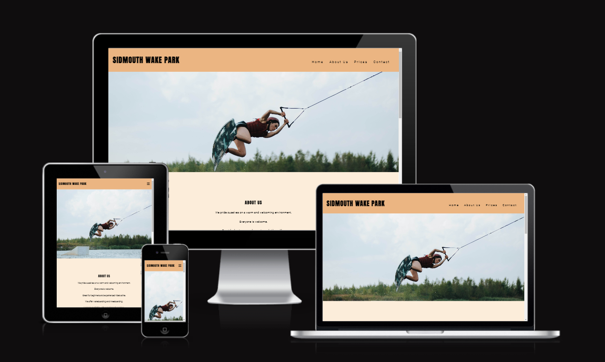
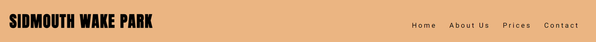
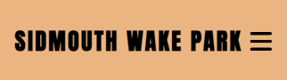
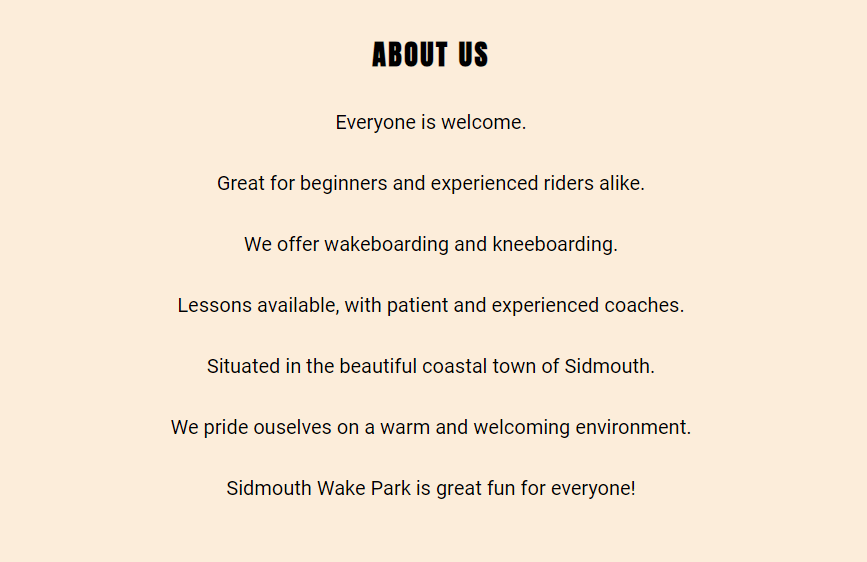
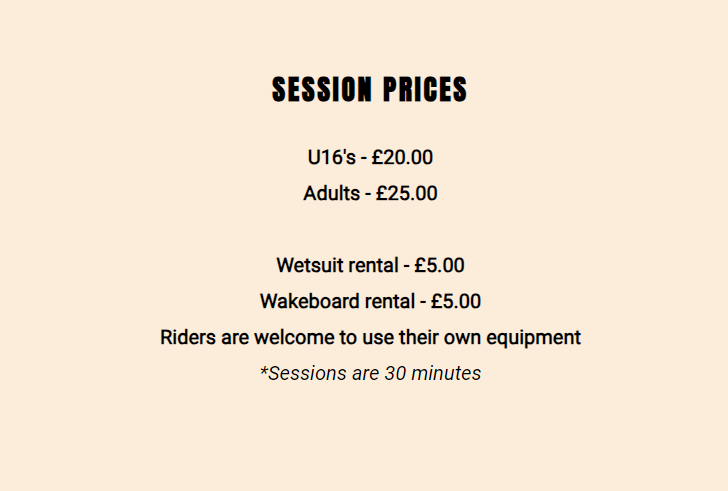
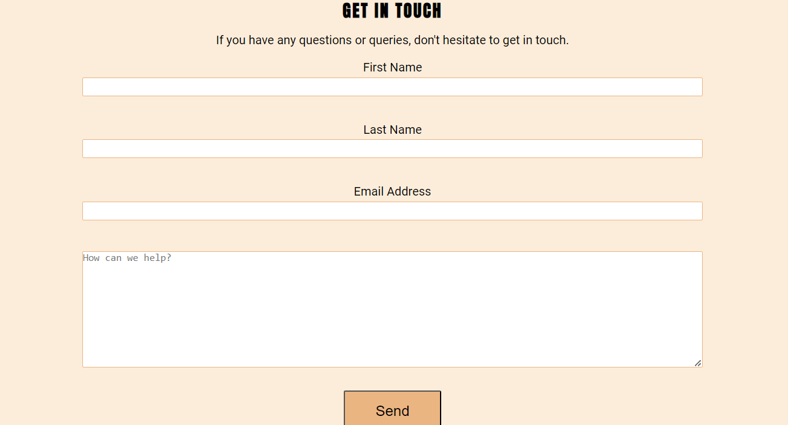
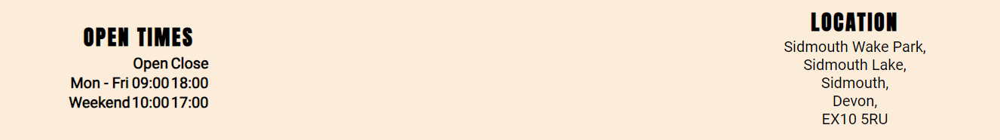

# Eden Essame Wakeboarding website

## Code Institute - First Milestone Project: User Centric Frontend Development.

This website was developed to showcase my ability to design and create a static website, using HTML and CSS.

It is a website about a fictional wakeboard park in the town in which I live in. Users of the website will be able to find all the information they need to know about the wakeboard park, services offered, prices, location and contact information. The site is targeted towards towards any potential customers who may be interested in wakeboarding.

## Features

### Navigation Section

* The Navigation bar is at the top of the page and fixed, so always visible and accessable wherever the user is on the page.
* The Navigation bar shows the business name in the top left corner.
* The other navigation links are to the right: Home, About Us, Prices and contact. They become a drop down menu on smaller screens where they would take up too much screen space.
*When a link is moused over on larger screens it is underlined to help the user see which link will be clicked.
* The Navigation bar tells the user the name of the business and website and the differnt sections of information are easy to find

### Home Section

The website opens on a picture of a wakeboarder at the park.

### About Us Section

* The About Us section tells users about the business and who its for.
* The About Us section lets users know what services are available.
* The About Us section lets users know that beginners and experienced riders are catered for.
* The About Us section lets people know lessons are available.

### Prices Section

* The Prices section lets users know the session prices and that there are different prices for adults and under 16's.
* The prices section lets users know how much equipment rental is, but that they can use their own.
* The Prices section lets users know how long a session lasts for.

### Contact Section 

#### Form

* The Contact section has a form that collects users name, email address and lets them ask question.
* The Contact form is useful to users as it lets them ask any questions they might have.

#### Opening times and Location

* The Contact section also has the opening times, so users know when they can visit.
* The Contact section also has the address and postcode, so users know where the park is located.

### Footer

* This section includes the social media links which users can use to visit the Facebook, Instagram and twitter pages of the business.

 

## Testing

* I tested the site and it works in different browsers: Chrome, Firefox and Microsoft Edge.
* I confirmed that the site is responsive and functions on different screen sizes using devtools device toolbar.
* I confirmed that the navigation, logo, about us, prices and contact text are all readable and easy to understand
* I confirmed that the form works: it requires entries in every field, only accepts an email in the email field and the submit button works.

### Bugs

* I was finding that when i clicked my links they didn't go to the top of the intended section, but a bit down bellow the heading of the section. My mentor helped me understand that this was because my fixed header was covering part of the section, so when the link is clicked, the section is not fully visible. To fix this, he advised me to add some padding to the top of each section to account for the height of the fixed header. `padding-top: 100px;`

* I was finding that my footer wasn't appearing when I deployed my page, my mentor helped me realise that the link to my font awesome kit was no longer there, so the icons from font awesome were no longer linked and there was nothing to appear as the footer. Once I had relinked my font awesome kit the footer was visible. 

### Validator testing

* **HTML** 
  * The W3C validator found that in my form I hadn't added a corresponding "id" attribute to my first-name input element `<input type="text" name="first-name" required>` to link it to the "for" attribute of its corresponding label element `<label for="first-name">First Name</label>`. So I corrected that `<input type="text" name="first-name" id="first-name" class="text-input" required>`. 

  * The W3C validator also found that I had used a bad value: `role="img"` on my "aria-label" attribute. So I removed it.

  * Now, no errors were returned when passing through the official [W3C Validator](./readme-assets/HTML-validator.png)

* **CSS**
  * No errors were found when passing through the official [(jigsaw) Validator](./readme-assets/CSS-validator.png)

* **Accessibility**   
  * I confirmed that the colours and fonts used are easy to read and accessible by running it through [lighthouse devtools](./readme-assets/Lighthouse.png)

### Unfixed Bugs

* No unfixed bugs.

## Deployment

* The site was deployed to Git Hub pages using the following steps:
  * In the Github repository, click the settings tab.
  * Under "General" in the subsection "Code and automation" click "Pages".
  * In the "Build and deployment" section, under "Source" select "Deploy from a branch" from the dropdown menu. 
  * Under "Branch" select "Main" from the dropdown menu and save.
  * The link to the website can be found at the top of the page.
  * The deployed website will update automatically with new commits to the master branch. 

## Credits

### Content

* The code for the fixed navigation dropdown menu and social media links were taken from the Code Institute's [Love Running project](https://github.com/Code-Institute-Solutions/love-running-v3/tree/main/3.5b-toggling-a-dropdown-menu)

### Media

* The hero image was taken from [Pexles.com](https://www.pexels.com/photo/a-woman-wake-boarding-on-the-lake-9967368/) 

### Acknowledgements

* Help understanding and implementing HTML and CSS came from the Code Institutes Coders Coffee House and Love Running projects.
* Help in how to structure and layout a README file from the Code Institutes [sample README](https://learn.codeinstitute.net/courses/course-v1:CodeInstitute+CSSE_PAGPPF+2021_Q2/courseware/66cf361c769a41d496f5001fae6f9be7/3b5cd5dc8313462aa5975a3c9b9a1a3c/) 
* Further help and understanding was sought from [W3schools](https://www.w3schools.com/html/default.asp).
* The Code Institute tutor support team for helping guide me.
* My mentor, Medale Oluwafemi, for his invaluable knowledge and guidance.
